 Laboratorio di Sistemi Operativi A.A. 2023-24
  ---------------------
`Informazioni sul gruppo`

•	`Nome gruppo`: Maestri del Byte

•	`E-mail referente`: federico.sgambelluri@studio.unibo.it

•	 `Componenti del Gruppo`:

* 	Barone Dalia Valeria: 0001097620

* 	Cozza Giuseppe: 0001077442

* 	Magli Simone: 0001077442

* 	Sgambelluri Federico: 0001068826

`Sommario`
```
1.	Descrizione del Progetto

      1.1 Architettura Generale

      1.1.2 Composizione del Sistema

      1.1.3 Interazione tra Componenti

      1.1.4 Rappresentazione Grafica

      1.2 Descrizione dettagliata delle singole componenti

      1.2.1 Struttura del Server

      1.2.2 Struttura del Client

      1.3 Suddivisione del lavoro tra i membri del gruppo

      1.3.1 Fasi del Progetto e Responsabilità


2. Descrizione e discussione del processo di implementazione

   2.1   Descrizione dei problemi

   2.1.1 Problemi legati alla concorrenza

   2.1.2 Problemi legati alla modello client server

   2.2 Descrizione degli strumenti utilizzati per l’organizzazione


3. Requisiti e istruzioni per utilizzare le applicazioni

   3.1 Avvio del programma

   3.1.1 Avvio del server

   3.1.2 Avvio del client

   3.2 Esempi degli output per ogni comando

   3.2.1 Esempi di comandi per il Client

   3.2.2 Esempi di comandi per il Server

   3.3 Estensioni utilizzate


4. Conclusioni e possibili sviluppi futuri
```

------------------------

1.Descrizione del Progetto
---------------------

_1.1 Architettura Generale_

> Il progetto realizzato è un sistema Publish/Subscribe basato su un'architettura client-server. Questo tipo di architettura è comunemente utilizzato in scenari dove si desidera che i messaggi siano inviati a più destinatari (subscribers) attraverso un canale centrale (server), senza che il mittente (publisher) debba preoccuparsi di chi riceverà i messaggi o di gestire le comunicazioni dirette con ciascun destinatario. Questo tipo di modello è particolarmente utile in contesti come la diffusione di notizie, notifiche di sistema, aggiornamenti in tempo reale, e molti altri casi d'uso simili.


_1.1.2 Composizione del Sistema_

Il sistema è composto da due componenti principali:

`Server`

> Il server è la componente centrale del sistema, responsabile della gestione delle connessioni dei client, del mantenimento dei topic e della distribuzione dei messaggi. Il server è stato progettato per essere altamente concorrente, sfruttando la gestione multi-thread per garantire la scalabilità e la reattività anche sotto carico elevato.
>
> •	Gestione delle Connessioni: Il server è responsabile della gestione delle connessioni dei vari client. Ogni volta che un client si connette, il server (in ascolto sulla porta predefinita 9000), assegna un nuovo thread dedicato (ClientHandler) per gestire la comunicazione con quel particolare client. Questo approccio permette al server di gestire più client contemporaneamente, sfruttando il multithreading.
>
> •	Gestione dei Topic: I topic rappresentano i canali di comunicazione su cui i publisher inviano messaggi e i subscriber ricevono notifiche. I topic vengono creati dinamicamente quando un client si registra come publisher, e il server lo memorizza in una struttura dati dedicata (nel nostro caso una ConcurrentHashMap), che garantisce l'accesso concorrente e sicuro da parte di più thread.
>
> •	Distribuzione dei Messaggi: Quando un publisher invia un messaggio su un topic, il server lo distribuisce a tutti i subscriber attivi iscritti a quel topic. Questa operazione è eseguita in modo efficiente grazie all'uso di set concorrenti (ConcurrentHashMap.newKeySet()), che permettono di gestire più subscriber senza rischi di inconsistenza dei dati.
>
> •	Amministrazione del sistema: Il server può entrare in una modalità di ispezione per un topic specifico, durante la quale può esaminare e cancellare messaggi. Durante questa fase, tutte le operazioni sul topic sono bloccate, e i comandi relativi al topic vengono messi in attesa fino al termine dell'ispezione.

`Client`

> Il client è progettato per operare in due modalità: Publisher e Subscriber. Ogni modalità offre comandi specifici per interagire con il server. Il client comunica con il server attraverso connessioni socket, inviando comandi testuali e ricevendo risposte dal server.
>
> •	Publisher: Un client che si registra come publisher su un topic ha la possibilità di inviare messaggi su quel topic. Ogni messaggio inviato è associato a un identificativo univoco, generato dal server, e viene memorizzato in una lista di messaggi relativa a quel topic.
>
> •	Registrazione al Topic: Il comando publish <topic> permette al client di registrarsi come publisher su un topic specifico. Se il topic non esiste, il server lo crea automaticamente.
>
> •	Invio di Messaggi: Con il comando send <message>, il publisher invia un messaggio al server, che viene memorizzato e distribuito ai subscriber del topic.
>
> •	Richiesta di Liste di Messaggi: I publisher possono richiedere la lista di tutti i messaggi inviati su un topic (listall) o solo i messaggi inviati dal publisher stesso (list).
>
> •	Subscriber: Un client che si registra come subscriber su un topic riceve automaticamente tutti i messaggi pubblicati su quel topic dopo il momento della sua iscrizione. Il server invia una notifica in tempo reale a ogni subscriber quando un nuovo messaggio viene pubblicato.
>
> •	Iscrizione al Topic: Il comando subscribe <topic> permette al client di registrarsi come subscriber a un topic. Da quel momento in poi, riceverà tutti i nuovi messaggi inviati su quel topic.
>
> •	Visualizzazione dei messaggi: Una volta iscritto a un topic, il subscriber riceve automaticamente tutti i messaggi pubblicati su di esso dal momento della sua iscrizione, ma può comunque visualizzare i messaggi inviati precedentemente mediale il comando listall .

__1.1.3 Interazione tra Componenti_

- **Flusso di Comunicazione**: I client comunicano con il server utilizzando una serie di comandi testuali, inviati tramite connessioni socket. Questi comandi permettono di gestire la registrazione ai topic, l'invio di messaggi, la richiesta di liste di messaggi e altre operazioni. Il server interpreta questi comandi e risponde in modo appropriato, gestendo le operazioni richieste e mantenendo la consistenza del sistema.

- **Gestione delle Risorse Condivise**: Per garantire che il sistema funzioni correttamente anche in presenza di molteplici connessioni e richieste concorrenti, vengono utilizzati meccanismi di sincronizzazione come le `ConcurrentHashMap`, che evitano problemi di concorrenza e garantiscono che le operazioni sui topic e sui messaggi siano eseguite in modo sicuro.

_1.1.4 Rappresentazione Grafica_

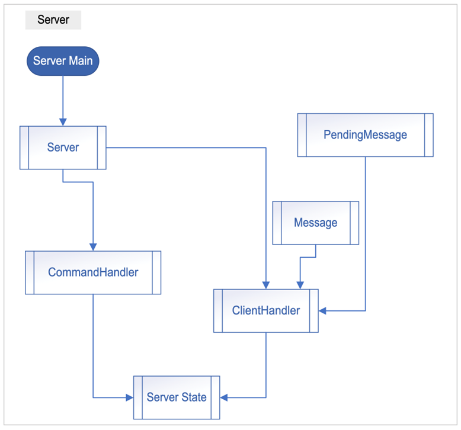
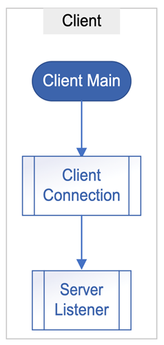

---

_1.2 Descrizione dettagliata delle singole componenti_

Questa sezione descrive in dettaglio le principali componenti del sistema: il **Server** e il **Client**, con particolare attenzione alle loro sotto-componenti e al ruolo di ciascuna classe nel sistema.

---

_1.2.1 Struttura del Server_

Il **server** è strutturato come un'applicazione multi-threaded che utilizza diverse classi per organizzare le varie funzionalità, descriviamo ora tutte le classi:

### Classe `Server`

La classe `Server` è responsabile dell’avvio del server, dell’accettazione delle connessioni dai client e della gestione delle interazioni generali.
- Inizia ad ascoltare sulla porta specificata per le nuove connessioni.
- Accetta nuovi client e crea un `ClientHandler` per ognuno di essi.
- Avvia un `CommandHandler` per permettere all’amministratore di interagire con il server.
- Fornisce metodi per fermare il server e disconnettere tutti i client.

**Attributi principali**:
- `static final int PORT = 9000`: Porta su cui il server ascolta le connessioni.
- `List<ClientHandler> clientHandlers`: Lista dei `ClientHandler` attualmente attivi.
- `boolean isRunning`: Flag che indica se il server è in esecuzione.

**Metodi principali**:
- `start()`: Avvia il server e gestisce il ciclo principale di accettazione delle connessioni.
- `stop()`: Ferma l’esecuzione del server impostando `isRunning` a false.
- `disconnectAllClients()`: Disconnette tutti i client attualmente connessi.
- `getClientHandlers()`: Restituisce la lista dei client handler attivi.
- `isRunning()`: Restituisce lo stato di esecuzione del server.

**Interazioni con altre classi**:
- `ClientHandler`: Crea nuove istanze per gestire le connessioni dei client.
- `CommandHandler`: Avvia un’istanza per gestire i comandi amministrativi.

---
### Classe `ServerMain`

La classe `ServerMain` contiene il metodo main che avvia l’applicazione server.
- Crea un’istanza di `Server` e chiama il metodo `start()` per iniziare l’esecuzione.

**Metodi principali**:
- `main(String[] args)`: Metodo principale dell’applicazione, punto di ingresso del server.

---

### Classe `ClientHandler`

La classe `ClientHandler` estende `Thread` e gestisce la comunicazione tra il server e un singolo client connesso. Ogni volta che un nuovo client si connette, viene creata un’istanza di questa classe per gestire le interazioni con quel client specifico.
- Stabilisce i flussi di input e output per comunicare con il client attraverso il socket.
- Richiede al client di impostare un username univoco prima di procedere con altre operazioni.
- Interpreta ed esegue i comandi inviati dal client, come `publish`, `subscribe`, `send`, `list`, `listall`, `help`, `show` e `quit`.
- Consente ai publisher di inviare messaggi a un topic e notifica i subscribers iscritti a quel topic.
- Gestisce la chiusura della connessione e rimuove l’username dall’elenco degli username in uso.

**Attributi principali**:
- `Socket socket`: Il socket utilizzato per la comunicazione con il client.
- `Server server`: Riferimento all’istanza del server principale.
- `String topic`: Il topic corrente a cui il client è associato.
- `String clientAddress`: L’indirizzo IP e la porta del client.
- `String role`: Il ruolo del client (publisher o subscriber).
- `PrintWriter out`: Flusso di output per inviare messaggi al client.
- `String username`: L’username univoco del client.

**Metodi principali**:
- `run()`: Gestisce il ciclo di vita del client, compresa l’autenticazione, la ricezione dei comandi e la disconnessione.
- `isTopicLocked(String command, String topic)`: Verifica se il topic è attualmente bloccato per ispezione.
- `enqueueMessage(String topic, String messageText)`: Aggiunge un messaggio alla coda dei messaggi in attesa per un topic bloccato.
- `disconnect()`: Chiude la connessione con il client.
- `getHelp()`: Restituisce un elenco dei comandi disponibili per il client.
- `sendMessage(String topic, String messageText)`: Invia un messaggio al topic specificato.
- `listMessages(PrintWriter out, String topic, boolean includeAll)`: Elenca i messaggi del topic.
- `subscribeToTopic(String topic)`: Iscrive il client come subscriber al topic.
- `notifySubscribers(String topic, Message message)`: Invia una notifica a tutti i subscribers.
- `showTopics(PrintWriter out)`: Mostra al client la lista di tutti i topic disponibili.
- `getNextMessageId(String topic)`: Genera un nuovo ID per un messaggio.
- `sendMessageToClient(String message)`: Invia un messaggio diretto al client.

---
---

### Classe `CommandHandler`

La classe `CommandHandler` estende `Thread` e gestisce i comandi amministrativi inseriti nella console del server. Permette all’amministratore di interagire con il server durante l’esecuzione.
- Utilizza un `BufferedReader` per leggere i comandi inseriti dall’amministratore.
- Supporta comandi come `quit`, `show`, `admin` e `inspect`.
- Il comando `inspect` permette di bloccare un topic e aprire una sessione interattiva per analizzarlo, con la possibilità di elencare o eliminare messaggi.

**Attributi principali**:
- `Server server`: Riferimento all’istanza del server principale.

**Metodi principali**:
- `run()`: Gestisce il ciclo di lettura ed esecuzione dei comandi amministrativi.
- `showAdminCommands()`: Mostra all’amministratore l’elenco dei comandi disponibili.
- `showTopics()`: Elenca tutti i topic attualmente esistenti sul server.
- `inspectTopic(BufferedReader consoleReader, String topic)`: Avvia una sessione interattiva per ispezionare un topic specifico.
- `listAllMessages(String topic)`: Elenca tutti i messaggi presenti in un topic.
- `deleteMessage(String topic, int id)`: Elimina un messaggio identificato da un ID all’interno di un topic.
- `processPendingMessages(String topic)`: Processa i messaggi in attesa dopo la fine dell’ispezione, inviandoli ai subscriber.
- `sendMessage(String topic, Message message)`: Invia un messaggio al topic e notifica i subscriber, utilizzato durante il processamento dei messaggi in attesa.
- `updatePublisherMessages(String topic, Message message)`: Aggiorna la lista dei messaggi associati al publisher.
- `notifySubscribers(String topic, Message message)`: Notifica tutti i subscriber di un nuovo messaggio su un topic.
- `notifyClient(String username, String message)`: Invia un messaggio diretto a un client specifico.
- `getNextMessageId(String topic)`: Genera un nuovo ID univoco per un messaggio nel topic specificato.

**Interazioni con altre classi**:
- `ServerState`: Modifica lo stato globale del server durante le operazioni di ispezione e gestione dei topic.
- `Message`: Crea nuove istanze di `Message` durante il processamento dei messaggi in attesa.
- `ClientHandler`: Interagisce con i client per notificare eventi importanti come la consegna di messaggi in attesa.

---

### Classe `ServerState`

La classe `ServerState` mantiene lo stato globale del server. Tutti gli attributi sono statici e rappresentano le strutture dati condivise tra i vari componenti dell’applicazione.

**Attributi principali**:
- `Map<String, List<Message>> topics`: Mappa che associa ogni topic alla lista dei messaggi associati.
- `Map<String, Map<String, List<Message>>> publisherMessages`: Mappa che associa ogni publisher ai suoi messaggi per ogni topic.
- `Map<String, Set<Socket>> subscribers`: Mappa che associa ogni topic all’insieme dei socket dei subscribers iscritti.
- `Set<String> lockedTopics`: Insieme dei topic attualmente bloccati per ispezione.
- `Map<String, Queue<PendingMessage>> pendingMessages`: Mappa che associa ogni topic alla coda dei messaggi in attesa di essere processati.
- `Map<String, Integer> lastMessageId`: Mappa che tiene traccia dell’ultimo ID utilizzato per i messaggi di ogni topic.
- `Map<String, ClientHandler> usernamesInUse`: Mappa che associa gli username attualmente in uso ai rispettivi `ClientHandler`.

---

### Classe `Message`

La classe `Message` rappresenta un singolo messaggio inviato da un publisher a un topic.

**Attributi principali**:
- `int id`: Identificatore univoco del messaggio all’interno del topic.
- `String text`: Contenuto testuale del messaggio.
- `String timestamp`: Data e ora in cui il messaggio è stato creato, formattato come “dd/MM/yyyy - HH:mm:ss”.
- `String publisherUsername`: Username del publisher che ha inviato il messaggio.

**Metodi principali**:
- `Message(int id, String text, String publisherUsername)`: Costruttore che inizializza un nuovo messaggio con l’ID, il testo e l’username del publisher. Il timestamp viene generato automaticamente al momento della creazione.
- `getId()`: Restituisce l’ID del messaggio.
- `setId(int id)`: Imposta l’ID del messaggio.
- `getText()`: Restituisce il contenuto testuale del messaggio.
- `getTimestamp()`: Restituisce il timestamp del messaggio.
- `getPublisherUsername()`: Restituisce l’username del publisher.
- `getPublisherSocket()`: Recupera il socket del publisher tramite l’username, accedendo a `ServerState.usernamesInUse`.

**Interazioni con altre classi**:
- `ServerState`: Utilizza lo stato del server per recuperare informazioni sul publisher.

---

### Classe `PendingMessage`

La classe `PendingMessage` rappresenta un messaggio che è stato inviato mentre un topic era bloccato per ispezione e che quindi deve essere processato successivamente.

**Attributi principali**:
- `String username`: Username del client che ha inviato il messaggio.
- `String messageText`: Contenuto testuale del messaggio.

**Metodi principali**:
- `PendingMessage(String username, String messageText)`: Inizializza un nuovo messaggio in attesa con l’username del client e il testo del messaggio.
- `getUsername()`: Restituisce l’username del client.
- `getMessageText()`: Restituisce il contenuto testuale del messaggio.

---

---

_1.2.2 Struttura del Client_

### Classe `ClientMain`

La classe `ClientMain` contiene il metodo main che funge da punto di ingresso per l’applicazione client. Il suo scopo principale è avviare la connessione al server utilizzando la classe `ClientConnection`.

- Avvio dell’applicazione client.
- Analizza gli argomenti della riga di comando per determinare l’indirizzo IP e la porta del server.
- Crea un’istanza di `ClientConnection` con gli argomenti forniti.
- Chiama il metodo `start()` su `ClientConnection` per avviare la connessione e l’interazione con il server.

**Metodi principali**:
- `main(String[] args)`: Punto di ingresso dell’applicazione client. Controlla se sono stati forniti argomenti per l’indirizzo IP e la porta del server. Crea un’istanza di `ClientConnection` passando gli argomenti della riga di comando. Avvia la connessione chiamando `clientConnection.start()`.

**Interazioni con altre classi**:
- `ClientConnection`: La classe `ClientMain` interagisce direttamente con `ClientConnection` per avviare l’applicazione client.

---

### Classe `ClientConnection`

La classe `ClientConnection` gestisce la connessione del client al server e l’interazione tra l’utente e il server.

- **Connessione al server**: Stabilisce una connessione socket con il server utilizzando l’indirizzo IP e la porta specificata.
- **Autenticazione dell’utente**: Richiede all’utente di inserire un nome utente univoco.
- **Gestione dell’input utente**: Legge i comandi inseriti dall’utente attraverso la console e li invia al server.
- **Gestione delle risposte dal server**: Avvia un thread separato (`ServerListener`) per ascoltare continuamente le risposte e i messaggi dal server.
- **Chiusura della connessione**: Gestisce la disconnessione dal server.

**Attributi principali**:
- `String serverAddress`: Indirizzo IP del server. Valore predefinito: "127.0.0.1".
- `int serverPort`: Porta del server. Valore predefinito: 9000.
- `Socket socket`: Socket per la connessione al server.
- `BufferedReader in`: Flusso di input per leggere dati dal server.
- `PrintWriter out`: Flusso di output per inviare dati al server.
- `BufferedReader userInput`: Flusso di input per leggere i comandi dall’utente.

**Metodi principali**:
- `ClientConnection(String[] args)`: Costruttore che accetta gli argomenti della riga di comando per l’indirizzo IP e la porta del server.
- `void start()`: Metodo principale che avvia la connessione al server, gestisce l’autenticazione e la comunicazione.
- `private void authenticate() throws IOException`: Gestisce l’autenticazione dell’utente richiedendo un nome utente.
- `private void handleUserInput() throws IOException`: Gestisce l’input dell’utente e invia i comandi al server.

**Interazioni con altre classi**:
- `ServerListener`: Nel metodo `start()`, viene creata un’istanza di `ServerListener` per ascoltare i messaggi dal server in modo asincrono.

---

### Classe `ServerListener`

La classe `ServerListener` estende `Thread` e si occupa di ascoltare i messaggi dal server in modo asincrono, permettendo all’utente di continuare a interagire con l’applicazione senza interruzioni.

- Ascolto continuo dei messaggi dal server.
- Gestione delle interruzioni di connessione.

**Attributi principali**:
- `BufferedReader in`: Flusso di input per leggere i messaggi dal server.

**Metodi principali**:
- `ServerListener(BufferedReader in)`: Costruttore che inizializza il flusso di input.
- `public void run()`: Metodo eseguito quando il thread viene avviato. Legge continuamente i messaggi dal server e li stampa sulla console dell’utente.

**Interazioni con altre classi**:
- `ClientConnection`: Viene istanziato e avviato da `ClientConnection` nel metodo `start()`.

---

Dettagli Implementativi:
- **Gestione dei Flussi**: Utilizza `BufferedReader` e `PrintWriter` per la gestione dei flussi di input e output.
- **Gestione delle Eccezioni**: Il metodo `start()` gestisce le eccezioni `IOException` per eventuali errori di connessione.
- **User Experience**: Fornisce messaggi all’utente per guidarlo nel processo di autenticazione e nell’uso dei comandi disponibili.

---

## 1.3 Suddivisione del lavoro tra i membri del gruppo

In questa sezione, descriveremo come le attività del progetto sono state suddivise tra i membri del gruppo. Questo non solo evidenzia la collaborazione all'interno del team, ma mostra anche che ogni componente ha avuto un ruolo specifico e ha contribuito con competenze particolari.

### Approccio alla Suddivisione del Lavoro

Il progetto è stato suddiviso in diverse fasi, ognuna delle quali è stata assegnata a specifici membri del gruppo in base alle loro competenze, interessi e disponibilità. L'approccio seguito è stato di collaborare strettamente su decisioni chiave, mentre per l'implementazione tecnica ogni membro ha avuto la responsabilità primaria su determinati moduli o componenti.

### 1.3.1 Fasi del Progetto e Responsabilità

1. **Progettazione dell'Architettura**

    - **Responsabile**: Giuseppe Cozza & Simone Magli
    - **Descrizione**: La progettazione dell'architettura generale del sistema, inclusa la definizione delle interfacce tra le componenti (client e server) e la scelta delle strutture dati (come `ConcurrentHashMap` per i topic e i subscriber). Durante questa fase sono state prese decisioni chiave sulla gestione della concorrenza e sull'uso di tecniche di sincronizzazione.

2. **Implementazione del Server**

    - **Responsabile**: Federico Sgambelluri & Dalia Valeria Barone
    - **Descrizione**: L'implementazione della logica del server, inclusa la gestione delle connessioni dei client, la creazione e gestione dei topic, la distribuzione dei messaggi ai subscriber e l'integrazione con le strutture dati concorrenti. Questi membri hanno anche lavorato sull'implementazione delle sessioni di ispezione dei topic, gestendo il blocco dei topic e la coda dei messaggi in attesa.

3. **Implementazione del Client**

    - **Responsabile**: Giuseppe Cozza & Simone Magli
    - **Descrizione**: Lo sviluppo dell'applicazione client, con particolare attenzione alla gestione delle connessioni socket, l'invio di comandi al server e la ricezione di risposte. Questo include la gestione delle modalità Publisher e Subscriber, l'implementazione dei comandi `publish`, `subscribe`, `send`, `list`, e `listall`, e la sincronizzazione con il server per garantire la correttezza delle operazioni.

4. **Testing e Debugging**

    - **Responsabile**: Federico Sgambelluri, Dalia Valeria Barone, Giuseppe Cozza & Simone Magli
    - **Descrizione**: Il test completo del sistema per identificare e risolvere bug, specialmente quelli legati alla concorrenza e alla gestione delle connessioni. Questi membri hanno creato una serie di scenari di test per verificare il corretto funzionamento dei comandi client, la gestione dei topic e la robustezza del server sotto carico.

5. **Documentazione e Presentazione del Progetto**

    - **Responsabile**: Federico Sgambelluri & Dalia Valeria Barone
    - **Descrizione**: La stesura della documentazione del progetto, che include una descrizione dettagliata dell'architettura, delle singole componenti, delle decisioni implementative e dei problemi risolti. La preparazione della documentazione è stata un lavoro collaborativo tra i membri del gruppo per garantire che tutte le parti del progetto fossero ben rappresentate e spiegate chiaramente.

### Collaborazione e Integrazione

Oltre alle responsabilità principali, tutti i membri del gruppo hanno collaborato mediante gruppi di lavoro online o in presenza durante tutta la stesura del codice, le revisioni del codice e le discussioni architetturali. Questo ha assicurato che tutte le decisioni chiave fossero ben comprese da ogni membro e che il codice fosse coerente e integrato senza problemi.

---
## 2. Descrizione e discussione del processo di implementazione

### 2.1 Descrizione dei problemi

#### 2.1.1 Problemi legati alla concorrenza

- **Condizioni di Race**:
    - **Problema**: Accessi simultanei alle strutture dati condivise potevano portare a inconsistenze.
    - **Soluzione**: Utilizzo di `ConcurrentHashMap` e sincronizzazione esplicita su sezioni critiche.

- **Deadlock Potenziali**:
    - **Problema**: Blocchi multipli potevano causare stalli nel sistema.
    - **Soluzione**: Riduzione dell’uso di blocchi sincronizzati annidati e attenzione all’ordine di acquisizione dei lock.

- **Gestione delle Risorse**:
    - **Problema**: Necessità di garantire che le risorse (es. socket) fossero correttamente rilasciate.
    - **Soluzione**: Implementazione di blocchi `try-catch` e gestione attenta delle eccezioni.

#### 2.1.2 Problemi legati al modello client-server

- **Gestione delle Disconnessioni**:
    - **Problema**: Disconnessioni improvvise dei client potevano lasciare risorse non rilasciate.
    - **Soluzione**: Implementazione di meccanismi di rilevamento delle disconnessioni per pulire le risorse.

- **Scalabilità**:
    - **Problema**: Con un alto numero di client, le performance potevano degradare.
    - **Soluzione**: Ottimizzazione del codice e utilizzo di strutture dati concorrenti efficienti.

- **Sicurezza**:
    - **Problema**: Prevenire l’utilizzo di username duplicati o attacchi di tipo Denial of Service.
    - **Soluzione**: Validazione rigorosa dei dati in ingresso e limitazione del numero di connessioni per IP.

---

### 2.2 Descrizione degli strumenti utilizzati per l’organizzazione

#### Sviluppo del progetto

- **IDE**: Abbiamo scelto IntelliJ IDEA per lo sviluppo del codice in Java, in quanto è l’ambiente di sviluppo integrato più familiare a tutti i membri del gruppo. Questo IDE era già stato utilizzato in precedenza per altri progetti di programmazione e si integra perfettamente con GitHub, facilitando la gestione del versionamento. Inoltre, IntelliJ dispone della funzionalità `//TODO`, utile per annotare e tenere traccia delle modifiche future da apportare al codice.

#### Comunicazione tra i membri del gruppo

- **Discord**: Per la comunicazione a distanza, abbiamo utilizzato Discord per effettuare chiamate con condivisione dello schermo. Questo strumento è stato fondamentale per permettere a tutti di partecipare in tempo reale allo sviluppo del progetto. Discord è un'applicazione che utilizziamo da anni per studiare in gruppo e massimizzare l’apprendimento.

- **WhatsApp**: Utilizzato per scambi di messaggi informali e veloci, come ad esempio idee dell’ultimo minuto o aggiornamenti rapidi al di fuori delle sessioni di studio.

#### Condivisione del codice

- **GitHub**:
    - Abbiamo utilizzato un repository privato su GitHub per gestire il controllo di versione del progetto.
    - Abbiamo sfruttato il branching per sviluppare funzionalità specifiche, mantenendo il codice organizzato.
    - Le pull request ci hanno consentito di effettuare revisioni del codice, garantendo la tracciabilità del lavoro svolto e la condivisione delle modifiche tra i membri del gruppo.

#### Gestione del progetto

- **Microsoft Word**: Utilizzato per la stesura di bozze, idee preliminari o versioni provvisorie di parti del codice.

## 3. Requisiti e istruzioni per utilizzare le applicazioni

Per utilizzare l'applicazione, è necessario avere installata una delle versioni più recenti di **Java SE**, disponibile al seguente link: [Java SE Downloads](https://www.oracle.com/java/technologies/javase-downloads.html).  
Non è necessario utilizzare un IDE per eseguire il programma; è sufficiente utilizzare un terminale.  
Essendo un progetto a scopo didattico, l'esecuzione è pensata per avvenire in locale, senza la necessità di acquistare domini o hosting online. Il server e il client vengono eseguiti sulla stessa macchina tramite **localhost**.

---

### 3.1 Avvio del programma

#### 3.1.1 Avvio del server

Prima di tutto, è necessario avviare il server con i seguenti comandi:


Assicurarsi di eseguire i comandi nella cartella che contiene la cartella **Server** e non direttamente dentro **Server**.  
Se il percorso non viene incluso correttamente, si verificherà un errore.  
Il server si metterà in ascolto sulla porta predefinita **9000**, come indicato nella consegna del progetto.

---

#### 3.1.2 Avvio del client

Dopo che il server è in ascolto, è possibile avviare il client utilizzando un comando simile:


Anche in questo caso, è fondamentale eseguire il comando nella cartella che contiene la cartella **Client** e non all'interno di **Client**.  
Se il percorso non viene specificato correttamente, il terminale restituirà un errore.  
È possibile eseguire più client contemporaneamente, tutti connessi al server in ascolto sulla stessa porta.

### 3.2 Esempi degli output per ogni comando

#### 3.2.1 Esempi di comandi per il Client

NB: I dettagli di ogni comando sono descritti nella parte [1.2](#1.2-descrizione-dettagliata-delle-singole-componenti).

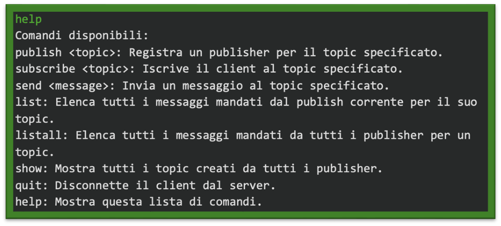
Figura 1: Il comando help fornisce un elenco di tutti i comandi disponibili per il client.


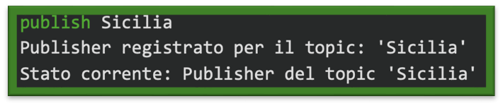  
Figura 2:Il client si registra come publisher per un determinato topic.


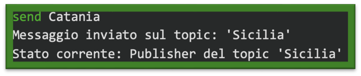  
Figura 3:Il publisher invia un messaggio al server sul topic selezionato.


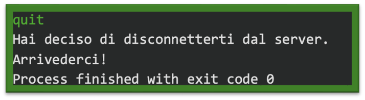  
Figura 4:Il client esce e si disconnette dal server.


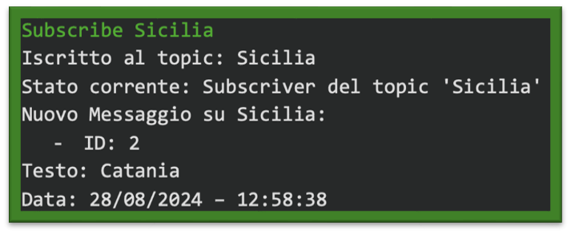  
Figura 5:Il client si iscrive a un topic per ricevere messaggi pubblicati su quel topic.


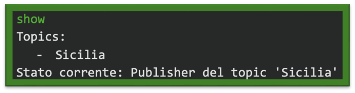  
Figura 6:Mostra una lista di tutti i topic creati e disponibili sul server.


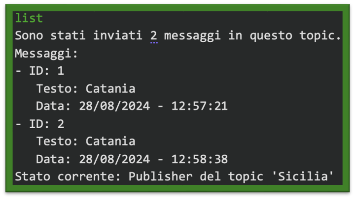  
Figura 7:Mostra la lista dei messaggi inviati dal publisher.


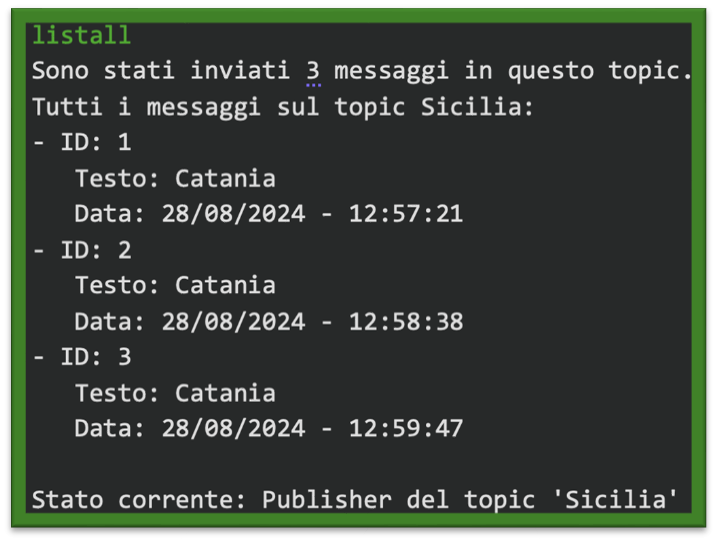
Figura 8:Mostra la lista completa di tutti i messaggi inviati su un topic.

---

#### 3.2.2 Esempi di comandi per il Server

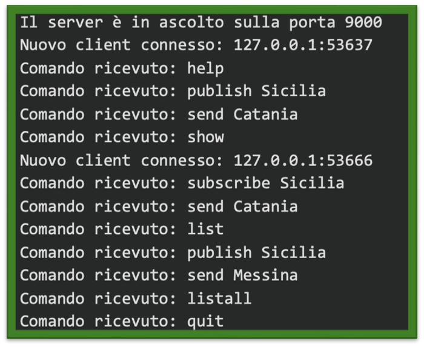 
Figura 9:L'immagine mostra una serie di comandi eseguiti dal client e ricevuti dal server. Si tratta di una sessione completa di interazioni, che include la pubblicazione, sottoscrizione e invio di messaggi su un topic, insieme all'elenco dei messaggi pubblicati

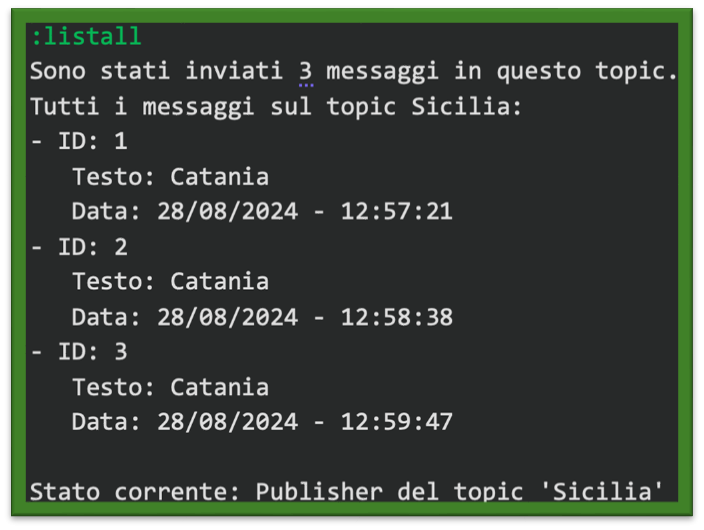  
Figura 10:Mostra la lista completa di tutti i messaggi inviati su un topic.


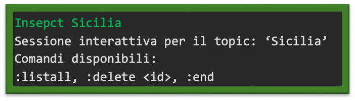  
Figura 11:Permette l'ispezione di un topic specifico e la possibilità di cancellare messaggi o visualizzarli.


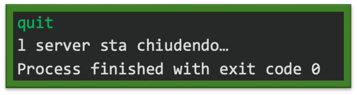 
Figura 12:Il comando chiude il server e disconnette tutti i client attivi.
 

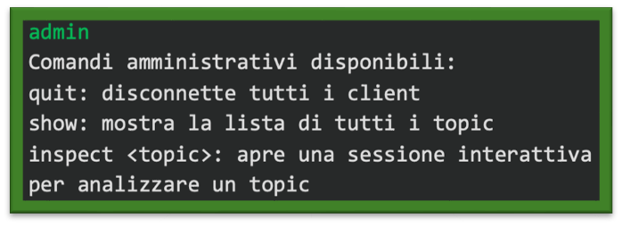  
Figura 13:Mostra i comandi amministrativi disponibili per la gestione del server.


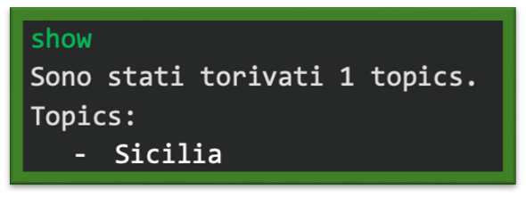  
Figura 14:Mostra una lista di tutti i topic creati e disponibili sul server.


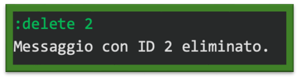  
Figura 15: Cancella il messaggio con ID 2 dal topic corrente durante la fase di ispezione.


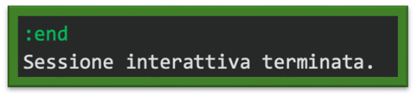
Figura 16:Termina la sessione di ispezione di un topic e riprende l'invio dei messaggi in coda.

---

### 3.3 Estensioni utilizzate

Non sono state utilizzate estensioni esterne per la realizzazione di questo programma.

---

## 4. Conclusioni e possibili sviluppi futuri

Il progetto ha raggiunto gli obiettivi prefissati, implementando con successo un sistema **Publish/Subscribe** funzionale e robusto.  
Il sistema gestisce in modo efficiente la comunicazione tra **publisher** e **subscriber**, garantendo l’integrità dei dati e mantenendo un'elevata reattività anche con numerosi client connessi.

### Possibili miglioramenti

- **Persistenza dei dati**: Un miglioramento significativo potrebbe essere l'implementazione della memorizzazione dei messaggi su disco, in modo da garantire la persistenza dei dati anche in caso di riavvio del server.

- **Autenticazione e sicurezza**: L'integrazione di meccanismi di autenticazione permetterebbe di migliorare la sicurezza del sistema, assicurando che solo utenti autorizzati possano accedere al servizio.

- **Interfaccia grafica (GUI)**: Lo sviluppo di una GUI per il client migliorerebbe notevolmente l'usabilità del sistema, rendendolo più intuitivo e accessibile agli utenti.

- **Supporto a messaggi multimediali**: Un'ulteriore estensione potrebbe riguardare il supporto per l'invio di file o contenuti multimediali, ampliando le capacità di comunicazione del sistema.
